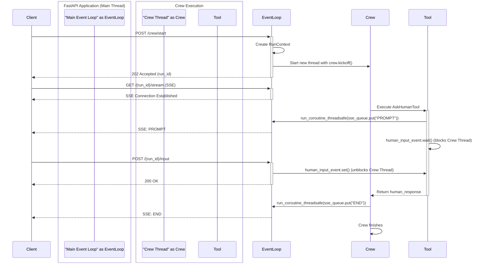

# Lumapps Poc

Toying around with crewai and fastapi. Trying to create an httpserver with human in the loop.

## Architecture

The Human-in-the-Loop (HITL) feature in this project uses a multi-threaded architecture to prevent the long-running `crewai` task from blocking the main FastAPI web server.

Here is a sequence diagram explaining the interaction:

## Limitations

### Horizontal Scaling

The current implementation is designed for a single-server deployment and **does not support horizontal scaling** out of the box.

The application's state, including the status of running crews and the synchronization events (`threading.Event`), is stored in the local memory of the Python process. In a multi-server environment with a load balancer, a request to start a crew could be routed to one server, while subsequent requests to stream its status or provide input could be routed to another server that has no knowledge of the running crew. This would result in `404 Not Found` errors and failures.

#### Solution for Scaling

To make this architecture scalable, the state must be externalized. The standard solution involves:
1.  **Centralized State Store**: Use a service like **Redis** to store the state of each run instead of a local Python dictionary.
2.  **Message Broker**: Replace the in-memory `threading.Event` with a **Redis Pub/Sub** channel for inter-process communication. This allows a crew running on one server to be signaled by a web request handled by another server.
3.  **Sticky Sessions**: For Server-Sent Events (SSE), configure the load balancer for **sticky sessions** (session affinity) to ensure a client remains connected to the same server for the duration of the stream.

This approach decouples the application state from individual server instances, enabling robust horizontal scaling.

## Understanding Your Crew

The lumapps-poc Crew is composed of multiple AI agents, each with unique roles, goals, and tools. These agents collaborate on a series of tasks, defined in `config/tasks.yaml`, leveraging their collective skills to achieve complex objectives. The `config/agents.yaml` file outlines the capabilities and configurations of each agent in your crew.

## Support

For support, questions, or feedback regarding the LumappsPoc Crew or crewAI.
- Visit our [documentation](https://docs.crewai.com)
- Reach out to us through our [GitHub repository](https://github.com/joaomdmoura/crewai)
- [Join our Discord](https://discord.com/invite/X4JWnZnxPb)
- [Chat with our docs](https://chatg.pt/DWjSBZn)

Let's create wonders together with the power and simplicity of crewAI.
